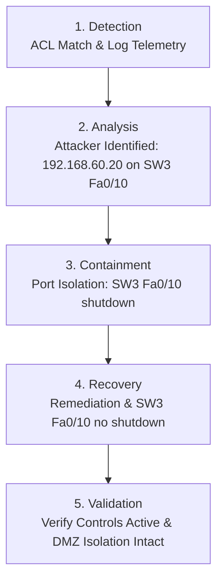

# ⚔️ CyphoraGrid: Attack Simulation & Incident Response Report

This document details the controlled attack simulations, lateral movement tests, management plane exploitation attempts, and the incident containment lifecycle executed in the **CyphoraGrid Enterprise Network Security Lab**.

---

## 🎯 Threat Model & Attacker Profile

- **Attacker Node:** `PC-ATTACKER` (`192.168.60.20/24`)
- **Location:** DMZ Zone (VLAN 60) on Switchport `SW3-ACCESS Fa0/10`
- **Assumed Objective:** Pivot from the DMZ to breach high-value internal networks (Servers VLAN 50, Finance VLAN 20, Management VLAN 10/99), conduct credential brute-forcing via SSH, and compromise network infrastructure.

---

## 🛡️ Attack Scenarios & Results

### 1. DMZ to Internal Subnet Probing & Lateral Movement
The attacker attempted reconnaissance and communication against internal departmental gateways and subnets.

| Target Gateway / Subnet | Destination VLAN | Attack Vector | Security Control | Observed Result | Threat Status |
| :--- | :--- | :--- | :--- | :--- | :--- |
| `192.168.10.1` | VLAN 10 (Management) | ICMP Echo / Subnet Scan | `DMZ-IN` Extended ACL | 🚫 Dropped / Unreachable | **BLOCKED** |
| `192.168.20.1` | VLAN 20 (Finance) | ICMP Echo / Subnet Scan | `DMZ-IN` Extended ACL | 🚫 Dropped / Unreachable | **BLOCKED** |
| `192.168.30.1` | VLAN 30 (HR) | ICMP Echo / Subnet Scan | `DMZ-IN` Extended ACL | 🚫 Dropped / Unreachable | **BLOCKED** |
| `192.168.40.1` | VLAN 40 (IT Security) | ICMP Echo / Port Probing | `DMZ-IN` Extended ACL | 🚫 Dropped / Unreachable | **BLOCKED** |
| `192.168.50.1` | VLAN 50 (Servers) | ICMP / Direct Routing | `DMZ-IN` Extended ACL | 🚫 Dropped / Unreachable | **BLOCKED** |
| `192.168.99.1` | VLAN 99 (Native Mgmt) | Router Gateway Probe | `DMZ-IN` Extended ACL | 🚫 Dropped / Unreachable | **BLOCKED** |

---

### 2. High-Value Target Breach Attempt (Internal Servers)
`PC-ATTACKER` attempted direct communication with internal production servers (`SRV1: 192.168.50.10`).

- **Vector:** ICMP Ping, TCP Syn scan toward HTTP/SSH/Database ports.
- **Expected Outcome:** Isolate internal corporate assets from public-facing DMZ compromise.
- **Observed Result:** 100% packet loss. All packets dropped at router subinterface `GigabitEthernet0/0.60` via access-group `DMZ-IN`.
- **Verdict:** ✅ **DEFENSE SUCCESSFUL**

---

### 3. DMZ Legitimate Service Exposure Test
`PC-ATTACKER` initiated permitted requests toward the dedicated DMZ server (`DMZ-SRV1: 192.168.60.10`).

- **HTTP Service (`Port 80`):** ✅ Accessible (Web page successfully rendered).
- **FTP Service (`Port 21`):** ✅ Accessible (Banner received, authentication prompt accessible).
- **SSH Service (`Port 22`):** 🚫 Connection refused / unauthorized.
- **Verdict:** ✅ **LEAST PRIVILEGE DMZ ACCESS VERIFIED**

---

### 4. Network Management Plane Attack (Unauthorized SSH)
`PC-ATTACKER` attempted SSH brute-force and administrative login against network infrastructure devices (`R1-EDGE`, `SW1-CORE`, `SW2-ACCESS`, `SW3-ACCESS`).

- **Attack Vector:** `ssh -l admin 192.168.99.11` / `192.168.99.1`
- **Mitigation Control:** `MGMT-SSH` Access Class applied to `line vty 0 4` filtering incoming TCP port 22 connections.
- **Result:** Connection closed by remote host / Dropped immediately at transport establishment.
- **Verdict:** ✅ **INFRASTRUCTURE ACCESS DENIED**

---

## 🚨 Incident Response & Containment Simulation

CyphoraGrid demonstrated a complete 5-stage Incident Response lifecycle against an active rogue host:

### Stage Execution Details:
1. **Detection:** ACL activity on `R1-EDGE` logged repeated blocked packets originating from `192.168.60.20`.
2. **Analysis:** Security operators traced the MAC and IP to switchport `Fa0/10` on `SW3-ACCESS` within VLAN 60.
3. **Containment:** Administrator issued `shutdown` on `SW3-ACCESS` interface `FastEthernet0/10`, severing physical link layer communication for the rogue host.
4. **Recovery:** Following forensic isolation and policy checks, administrative `no shutdown` was tested.
5. **Post-Incident Validation:** Re-verified that the DMZ perimeter ACL and Port Security remained active and enforced.
